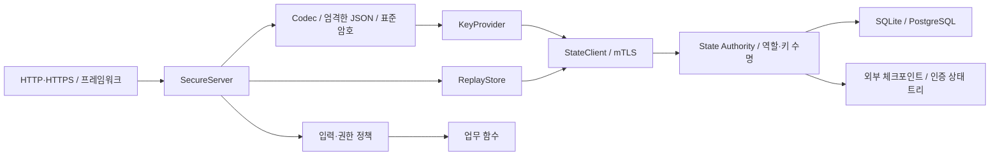

# 소스 구조

메시지 규격, 보안 처리, 상태 계약, 전송·프레임워크 어댑터를 분리합니다.

핵심 Codec·SecureServer는 웹 프레임워크를 참조하지 않습니다. 전송 계층은 원본 wire를 전달하고 인증 전 오류를 고정된 빈 응답으로 처리합니다. 키 선택·권한·작업 이름은 검증된 메시지와 신뢰한 키 레코드로 결정합니다.

| 경로 | 책임 |
| --- | --- |
| `spec/` | 메시지·상태 API 규격, 구현 계약, 신뢰 모델 |
| `sdks/*` | 독립 패키지, Codec, 엄격한 직렬화, 서버 처리 |
| `sdks/dotnet/SApi.AspNetCore` | ASP.NET Core endpoint |
| `services/state/sapi_state/storage.py` | SQL 스키마·쓰기 잠금·커밋 |
| `services/state/sapi_state/vault.py` | 역할 제한·키 수명·사용량·재전송·감사 |
| `services/state/sapi_state/tree.py` | 검증된 현재 상태의 인증 자료구조 |
| `services/state/sapi_state/files.py` | 파일 권한·fsync·원자적 교체 |
| `services/state/sapi_state/server.py` | 제한된 mTLS 관리 endpoint |
| `services/state/sapi_state/cli.py` | 발급·운영·인증서 등록·복구 명령 |
| `sdks/*/Schema`, `OwnedSql` | 닫힌 스키마와 소유자 조건·파라미터 바인딩 |
| `services/application/sapi_application/application.py` | 선언한 작업·scope·스키마·업무 상태의 조립 |
| `services/application/sapi_application/records.py` | 소유자·버전 조건의 DB 거래, 출력 검사 후 커밋 |
| `sdks/python/sapi/egress.py` | 고정 HTTPS 목적지와 DNS/응답 제한 |
| `services/application/sapi_application/server.py` | framing·Origin·peer·연결 수명을 제한하는 endpoint |
| `tests/drivers` | 실제 패키지 API를 공통 시험 계약에 연결 |
| `tools` | 빌드·상호운용·상태·의존성 검증·패키징 |

키 공급자는 `get(service,kid)`와 `reserve(service,kid,direction)`를 제공합니다. 예약은 공유 사용량을 원자적으로 소비하고 사용할 키 레코드를 반환합니다. 서버 응답 예약은 일회용 함수로 보관하며 동일 예약을 다시 사용할 수 없습니다. 상태 어댑터는 키를 캐시하지 않아 이후 조회에 폐기를 반영합니다.

재전송 저장소는 `claim(name,expiry,now)`와 `admit(service,kid,subject,operation,now,requests,period)`를 구현합니다. 관리된 admit는 kid의 상태에서 주체를 직접 얻고 전역 주체 quota와 등록 작업 제한을 공유합니다. 관리된 저장소는 서버의 시간과 키 수명을 다시 확인합니다. 장애·한도·무결성 실패를 성공으로 취급하지 않습니다.

선언형 서비스의 업무 DB는 상태 DB와 분리합니다. 기본 작업은 고정 SQL만 사용하고 owner는 인증 주체에서, phase는 등록된 전이에서 얻습니다. 변경 결과의 스키마·크기·버전 검사를 거래 안에서 완료합니다. 외부 요청은 선언된 GET 목적지만 허용하며 클라이언트의 URL·헤더를 실행하지 않습니다.

새 언어는 [메시지 구현 지침](../spec/IMPLEMENTING.md)과 [상태 API](../spec/STATE_API.md)를 구현해 연결합니다. 시험 드라이버 등록은 `tests/implementations.json`으로 확장하며 검증기가 N×N 조합을 생성합니다.

실사용 키와 인증서, 다운로드 의존성, 컴파일 중간 파일은 저장소에 포함하지 않습니다. 테스트의 공개 고정 키는 고정 벡터에만 사용합니다.
