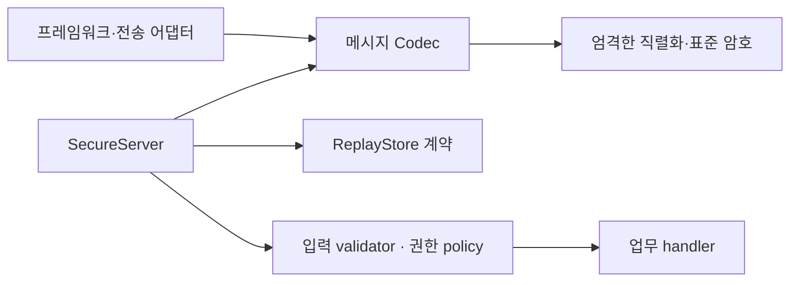

# 소스 구조와 확장 원칙

SAPi의 연결 조건은 프로그래밍 언어 이름이 아니라 SAPI 메시지 규격 준수다. .NET·Java·Python·JavaScript는 최초의 참조 구현이며 지원 언어의 상한이나 허용 목록이 아니다. Go, Rust, C/C++, PHP, Ruby, Swift 등도 같은 규격을 구현해 참여할 수 있다. 아직 없는 SDK의 구현 완료를 주장하지 않는다.

## 의존 방향

핵심 Codec과 SecureServer는 웹 프레임워크를 import하지 않는다. HTTP 상태/URL에서 작업이나 권한을 결정하지 않는다. 서버의 정책을 통과한 뒤에만 handler가 실행된다. 전송 어댑터는 원본 메시지 바이트를 전달하고 인증 전 오류를 빈 응답으로 바꾸며 업무 정책을 복제하지 않는다. HTTP 외 전송을 추가할 때도 같은 메시지·검증 경계를 유지한다.

## 저장소 구성

| 경로 | 계약과 책임 |
| --- | --- |
| `spec/` | 언어 독립 메시지 규격, 신뢰 모델, 구현 지침 |
| `sdks/` | 규격을 구현하는 독립 배포 단위; 언어 추가 시 하위 디렉터리 추가 |
| `sdks/dotnet/SApi.Protocol/` | `Keys`, `Messages`, `Serialization`, `Replay`, `Server`, `Transport` 모듈 |
| `sdks/dotnet/SApi.AspNetCore/` | ASP.NET Core 엔드포인트 어댑터만 포함 |
| `sdks/java/` | 별도 `Codec`, `SecureServer`, 키/context 타입, 재전송 계약, HTTP 바인딩 |
| `sdks/python/sapi/` | `codec`, `serialization`, `models`, `replay`, `server`, `http`; `__init__`은 공개 API만 제공 |
| `sdks/javascript/src/` | 같은 책임의 ESM 모듈; `index.js`는 공개 API만 제공, HTTP는 별도 import |
| `tests/vectors.json` | 공개 시험 키와 고정 벡터; 운영 키가 아님 |
| `tests/drivers/` | 각 구현을 공통 시험 계약에 연결; 실제 업무 라이브러리에 포함하지 않음 |
| `tests/implementations.json` | 빌드/실행 대상 등록; 언어 목록을 시험 코드에 고정하지 않음 |
| `tools/` | 의존성 준비, 적합성 검사, 로컬 패키징; 게시 기능 없음 |
| `examples/` | 루프백 데모; 운영 서버와 구분 |
| `docs/` | 사용법, 구조, 검증 결과 |

검증 중간 파일, TLS 시험용 개인 키, 내려받은 의존성과 컴파일 출력은 명시된 임시 `--work-dir`에 둔다. `dist/`는 로컬 배포 산출물이며 Git에서 제외한다. 실사용 키를 소스, 테스트 fixture, 예제 기본값으로 추가하지 않는다.

## 새 언어·프레임워크 추가

1. [구현 지침](../spec/IMPLEMENTING.md)에 따라 Codec·서버 처리 계약을 구현한다. 기존 SDK의 내부 객체나 런타임에 종속시키지 않는다.
2. [시험 드라이버 계약](../tests/DRIVER_CONTRACT.md)을 연결한다. `tests/implementations.json`에 빌드/실행 명령을 등록한다.
3. 검증기는 등록된 N개 구현의 모든 N×N 요청/응답 조합과 HTTP·HTTPS 조합을 생성한다. 대상 수 변경에 따라 검사 수가 바뀐다.
4. 프레임워크 어댑터는 Codec/서버를 호출하는 얇은 연결 계층으로 추가한다. 암호/인증을 다시 작성하지 않는다. 실제 엔드포인트 시험을 함께 제공한다.

재전송 저장소는 원자적 `claim(key, expiry, now)` 계약으로 교체한다. 권한은 호출자가 제출한 subject가 아니라 서버의 key registry로 판단한다. 새 암호 프로필, 비대칭 키 협상, 사용자 로그인은 wire format/위협 모델을 다시 검토하고 버전으로 구분해야 한다.
